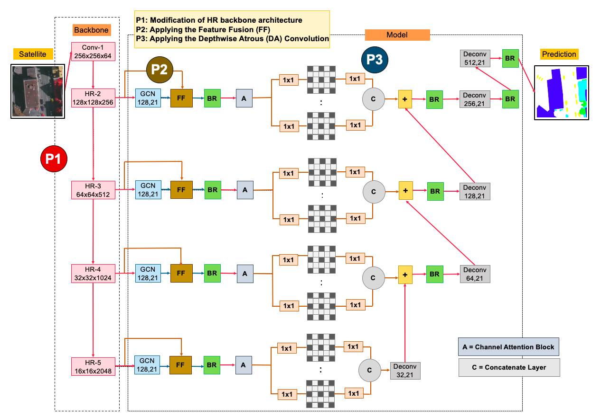
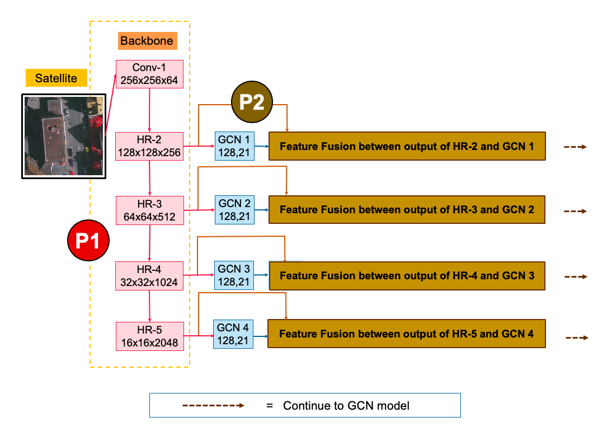
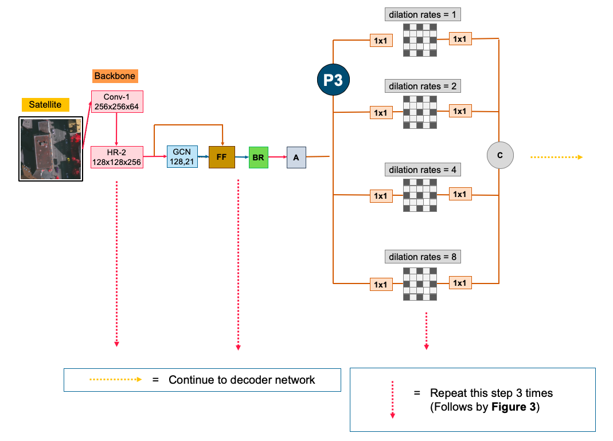
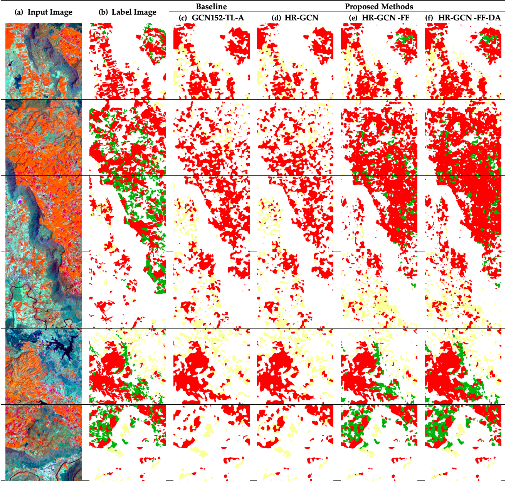
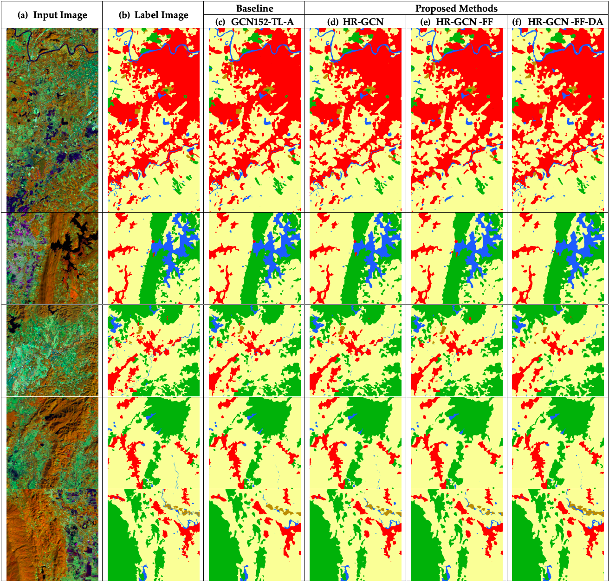
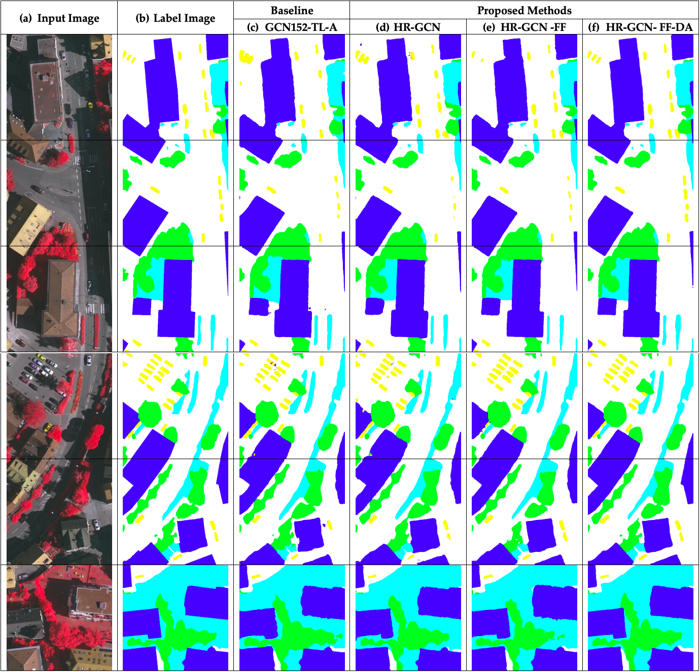

# **FusionNetGeoLabel** 🌍🛰️

[](https://opensource.org/licenses/MIT)
[](https://digital.car.chula.ac.th/chulaetd/8534/)

## **Overview** 📚

**FusionNetGeoLabel** is a cutting-edge deep learning framework tailored for semantic segmentation in remotely sensed imagery. This repository is a culmination of my Ph.D. research, aimed at enhancing the accuracy and efficiency of semantic labeling in satellite and aerial images. 🚀

One of the fundamental tasks in remote sensing is **semantic segmentation** on aerial and satellite imagery.  
FusionNetGeoLabel introduces a feature-fusion-based **Enhanced Global Convolutional Network** with **high-resolution representations** and **depthwise atrous convolutions** for state-of-the-art performance on remote sensing benchmarks (ISPRS Vaihingen, Potsdam, and Massachusetts Roads).

---

## **Author** ✍️

**Teerapong Panboonyuen**  
Ph.D. in Computer Engineering, Chulalongkorn University 🎓

---

## **Abstract** 📄

Semantic segmentation is a cornerstone in remote sensing, impacting various domains like agriculture 🌾, map updates 🗺️, and navigation 🚗. Despite the prominence of Deep Convolutional Encoder-Decoder (DCED) networks, they often falter in capturing low-level features such as rivers and low vegetation due to architectural constraints and limited domain-specific data.

This dissertation presents an advanced semantic segmentation framework designed for remote sensing, featuring five key innovations:

- **Global Convolutional Network (GCN):** 🧠 Enhances segmentation accuracy for remote sensing images.
- **Channel Attention Mechanism:** 🎯 Focuses on the most critical features for better performance.
- **Domain-Specific Transfer Learning:** 🛠️ Tackles the challenge of limited training data in remote sensing.
- **Feature Fusion (FF):** 🔄 Effectively integrates low-level features into the model.
- **Depthwise Atrous Convolution (DA):** 🔍 Refines feature extraction for improved segmentation.

Our experiments on private Landsat-8 datasets and the public "ISPRS Vaihingen" benchmark show that the proposed architecture significantly outperforms baseline models. 📊

---

## ✨ Key Features

- 🛰️ **High-Resolution Feature Fusion** with Atrous Depthwise Convolution  
- 🔥 **Global Convolutional Blocks** for capturing contextual dependencies  
- ⚡ Mixed Precision Training (AMP) support for fast GPU training  
- 📦 Modular PyTorch code with dataset loaders, metrics, and inference scripts  
- 🐳 Ready-to-run with **Docker** and **Google Colab**  

---

## 📜 Repo layout

```
FusionNetGeoLabel/
├── fusionnetgeolabel/
│   ├── __init__.py
│   ├── FusionNetGeoLabel.py
│   ├── heads.py
│   ├── modules.py
│   ├── utils/
│   │   ├── __init__.py
│   │   ├── data.py
│   │   ├── augmentation.py
│   │   ├── metrics.py
│   │   ├── losses.py
│   │   ├── train_utils.py
│   │   └── tiling.py
├── configs/
│   └── default.yaml
├── scripts/
│   ├── download_isprs_vaihingen.py
│   ├── download_isprs_potsdam.py
│   └── download_massachusetts_roads.py
├── train.py
├── test.py
├── inference.py
├── requirements.txt
├── Dockerfile
├── .gitignore
├── LICENSE
└── README.md
```

---

## **Publications & Resources** 📚

- **Ph.D. Thesis:** [Semantic Segmentation on Remotely Sensed Images Using Deep Convolutional Encoder-Decoder Neural Network](https://digital.car.chula.ac.th/chulaetd/8534/) 📜
- **Code Repository:** [GitHub - FusionNetGeoLabel](https://github.com/kaopanboonyuen/FusionNetGeoLabel) 💻
- **Pretrained Models:** [Download Pretrained Models](https://github.com/kaopanboonyuen/FusionNetGeoLabel) 📥
- **ISPRS Vaihingen Dataset:** [Download Dataset](https://paperswithcode.com/dataset/isprs-vaihingen) 🗂️
- **ISPRS Vaihingen Leaderboard:** [Semantic Segmentation Leaderboard](https://paperswithcode.com/sota/semantic-segmentation-on-isprs-vaihingen) 🏆

<p align="center">
  
  
  
</p>

## **How to Use** 🔧

---

## 🚀 Getting Started

### 1. Clone Repo
```bash
git clone https://github.com/kaopanboonyuen/FusionNetGeoLabel.git
cd FusionNetGeoLabel
````

### 2. Install Requirements

```bash
python -m venv .venv && source .venv/bin/activate
pip install --upgrade pip -r requirements.txt
```

### 3. Datasets

Supported datasets:

* [ISPRS Vaihingen](https://www2.isprs.org/commissions/comm2/wg4/benchmark/semantic-labeling-vaihingen/) 🏙️
* [ISPRS Potsdam](https://www2.isprs.org/commissions/comm2/wg4/2d-sem-label-potsdam/) 🌳
* [Massachusetts Roads](https://www.cs.toronto.edu/~vmnih/data/) 🛣️

Download scripts are provided:

```bash
python scripts/download_massachusetts_roads.py --out data/mass_roads
```

> ⚠️ ISPRS datasets require registration and acceptance of terms. Place downloaded `.zip` files into `data/` and the scripts will unpack + tile.

---

## 🏋️ Training

Example: training on Vaihingen dataset

```bash
python train.py \
  --dataset vaihingen \
  --data-dir ./data/vaihingen \
  --batch-size 8 \
  --epochs 100 \
  --lr 0.001 \
  --save-dir ./checkpoints
```

With mixed precision training (faster & memory efficient):

```bash
python train.py --config configs/default.yaml
```

---

## 🔍 Inference and Testing

Run inference on a large aerial image with sliding-window:

```bash
python inference.py --checkpoint runs/best.ckpt --image path/to/ortho.tif --out out.tif
```

```bash
python test.py --checkpoint runs/last.ckpt --data_dir data/mass_roads
```

---

## 🐳 Docker Support

Build and run in Docker:

```bash
docker build -t fusionnet-geolabel .
docker run --gpus all -it fusionnet-geolabel
```

---

## 🚀 Sample Results




---

## 📘 Citation

If you use this code, please cite:

```bibtex
@phdthesis{panboonyuen2019semantic,
  title  = {Semantic segmentation on remotely sensed images using deep convolutional encoder-decoder neural network},
  author = {Teerapong Panboonyuen},
  year   = {2019},
  school = {Chulalongkorn University},
  type   = {Ph.D. thesis},
  doi    = {10.58837/CHULA.THE.2019.158},
  address= {Faculty of Engineering},
  note   = {Doctor of Philosophy}
}
```

---

## 🏆 Acknowledgements

* ISPRS Vaihingen & Potsdam Datasets
* Massachusetts Roads Dataset
* PyTorch ecosystem
* Chulalongkorn University – Faculty of Engineering

---